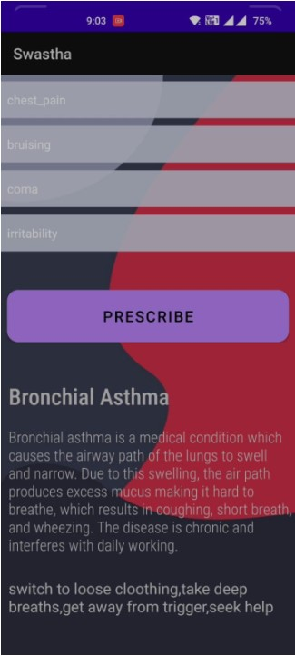

# Comparing ML Algorithm

The project involves developing android application that takes upto 5 symtoms from user and based on that it prescribes appropriate treatment of that perticular disease. 
Software used **Android**, **Java**, **Python**, **grid search cv** library to assess the performance of various Machine Learning algorithms. This project is targeted for elder people (60) keeping the UI simple to use. 

## Screenshots

